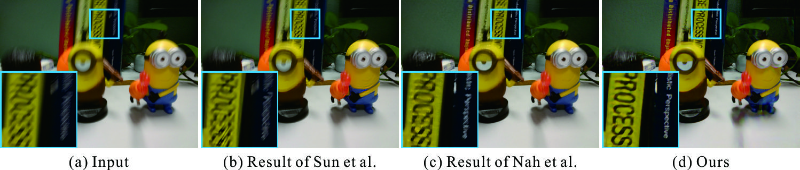
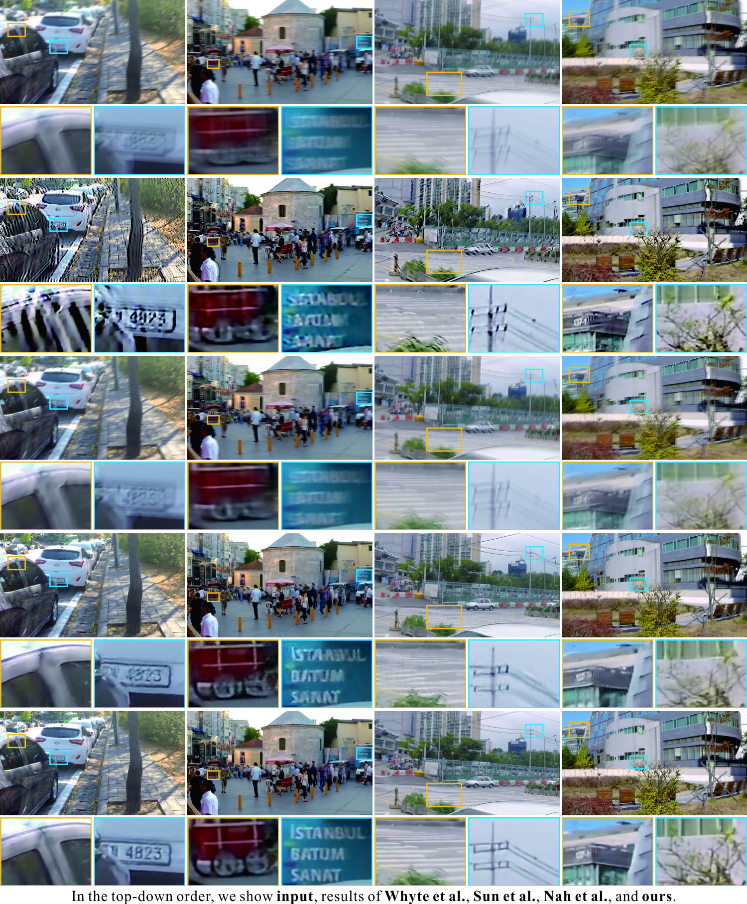
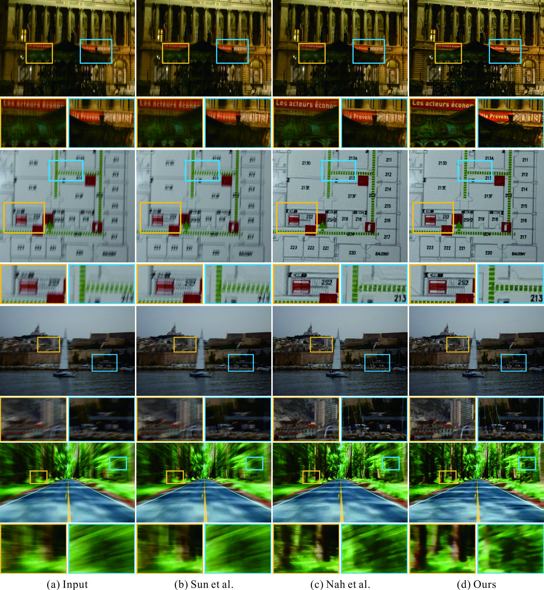

# Scale-recurrent Network for Deep Image Deblurring
by [Xin Tao](http://www.xtao.website), Hongyun Gao, [Xiaoyong Shen](http://xiaoyongshen.me/), [Jue Wang](http://juew.org), [Jiaya Jia](http://www.cse.cuhk.edu.hk/leojia/). ([pdf](http://www.xtao.website/projects/srndeblur/srndeblur_cvpr18.pdf))

### Our results on real data


### Results on the testing dataset


### More cases on real photos from previous papers:


## Prerequisites
- Python2.7
- Scipy
- Scikit-image
- numpy
- Tensorflow 1.4 with NVIDIA GPU or CPU (cpu testing is very slow)

## Installation
Clone this project to your machine. 

```bash
git clone https://github.com/jiangsutx/SRN-Deblur.git
cd SRN-Deblur
```

## Testing

Download pretrained models through: `download_model.sh` inside `checkpoints/`.

To test blur images in a folder, just use arguments 
`--input_path=<TEST_FOLDER>` and save the outputs to `--output_path=<OUTPUT_FOLDER>`.
For example:

```bash
python run_model.py --input_path=./testing_set --output_path=./testing_res
```

If you have a GPU, please include `--gpu` argument, and add your gpu id to your command. 
Otherwise, use `--gpu=-1` for CPU. 

```bash
python run_model.py --gpu=0
```

To test the model, pre-defined height and width of tensorflow 
placeholder should be assigned. 
Our network requires the height and width be multiples of `16`. 
When the gpu memory is enough, the height and width could be assigned to 
the maximum to accommodate all the images. 

Otherwise, the images will be downsampled by the largest scale factor to 
be fed into the placeholder. And results will be upsampled to the original size.

According to our experience, `--height=720` and `--width=1280` work well 
on a Gefore GTX 1050 TI with 4GB memory. For example, 

```bash
python run_model.py --height=720 --width=1280
```

### Evaluation
The quantitative results of **PSNR** and **SSIM** in the paper is 
calculated using MATLAB built-in function `psnr()` and `ssim()` based 
on the generated color results.

## Training

We trained our model using the dataset from 
[DeepDeblur_release](https://github.com/SeungjunNah/DeepDeblur_release). 
Please put the dataset into `training_set/`. And the provided `datalist_gopro.txt` 
can be used to train the model. 

Hyper parameters such as batch size, learning rate, epoch number can be tuned through command line:

```bash
python run_model.py --phase=train --batch=16 --lr=1e-4 --epoch=4000
```

## Models
We provided 3 models (training settings) for testing:
1. `--model=lstm`: This model implements exactly the same structure in our paper.
Current released model weights should produce `PSNR=30.19, SSIM=0.9334` on GOPRO testing dataset.
2. `--model=gray`: According to our further experiments after paper acceptance, we are able
to get a slightly better model by tuning parameters, even without LSTM. 
This model should produce visually sharper and quantitatively better results. 
3. `--model=color`: Previous models are trained on gray images, and may produce color
ringing artifacts. So we train a model directly based on RGB images. 
This model keeps better color consistency, but the results are less sharp.
### How to choose
If you would like to compare performance against our method, you can use 
model `gray` and `lstm`. 
If you want to restore blurry images you can try `gray` and `color`. 
And `color` is very useful in low-light noisy images.  

## Reference
If you use any part of our code, or SRN-Deblur is useful for your research, please consider citing: 

```bibtex
@inproceedings{tao2018srndeblur,
  title={Scale-recurrent Network for Deep Image Deblurring},
  author={Tao, Xin and Gao, Hongyun and Shen, Xiaoyong and Wang, Jue and Jia, Jiaya},
  booktitle={IEEE Conference on Computer Vision and Pattern Recognition (CVPR)},
  year={2018}
}
```

## Contact
We are glad to hear if you have any suggestions and questions.

Please send email to xtao@cse.cuhk.edu.hk

## Reference
[1] `Sun et al.` J. Sun, W. Cao, Z. Xu, and J. Ponce. *Learning a convolutional
neural network for non-uniform motion blur removal.* In CVPR, pages 769–777. IEEE, 2015.

[2] `Nah et al.` S. Nah, T. H. Kim, and K. M. Lee. *Deep multi-scale convolutional
neural network for dynamic scene deblurring.* pages 3883–3891, 2017.

[3] `Whyte et al.` O. Whyte, J. Sivic, A. Zisserman, and J. Ponce. *Nonuniform
deblurring for shaken images.* International Journal on Computer Vision, 98(2):168–186, 2012.