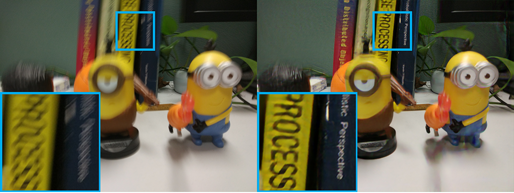
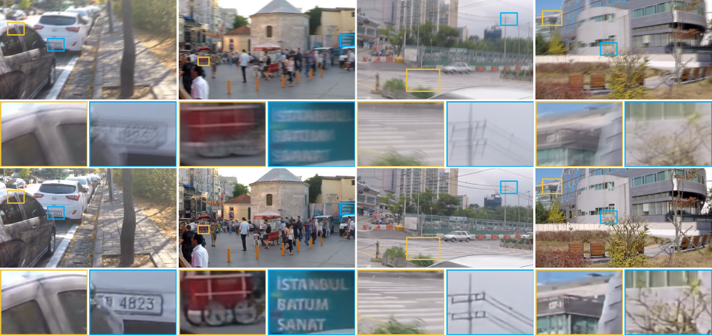
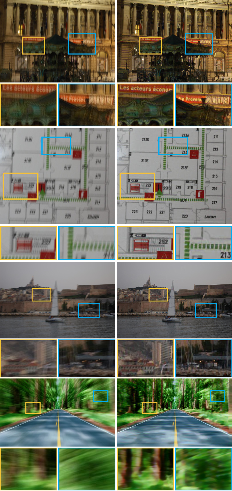

# Scale-recurrent Network for Deep Image Deblurring
by [Xin Tao](http://www.xtao.website), Hongyun Gao, [Xiaoyong Shen](http://xiaoyongshen.me/), [Jue Wang](http://juew.org), [Jiaya Jia](http://www.cse.cuhk.edu.hk/leojia/). ([pdf](https://arxiv.org/abs/1802.01770))

Our results on real data:

Results on the testing dataset:

More cases on real photos from previous papers:

We will soon release code for training and testing.

## Citation

If you use any part of our code, or SRN-Deblur is useful for your research, please consider citing:

    @InProceedings{tao2018srndeblur,
      author    = {Xin Tao and
                   Hongyun Gao and
                   Xiaoyong Shen and
                   Jue Wang and
                   Jiaya Jia},
      title = {Scale-recurrent Network for Deep Image Deblurring},
      booktitle = {IEEE Conference on Computer Vision and Pattern Recognition (CVPR)},
      month = {Jun},
      year = {2018}
    }

## Contact
We are glad to hear if you have any suggestions, questions about implementation or sequences for testing.

Please send email to xtao@cse.cuhk.edu.hk
